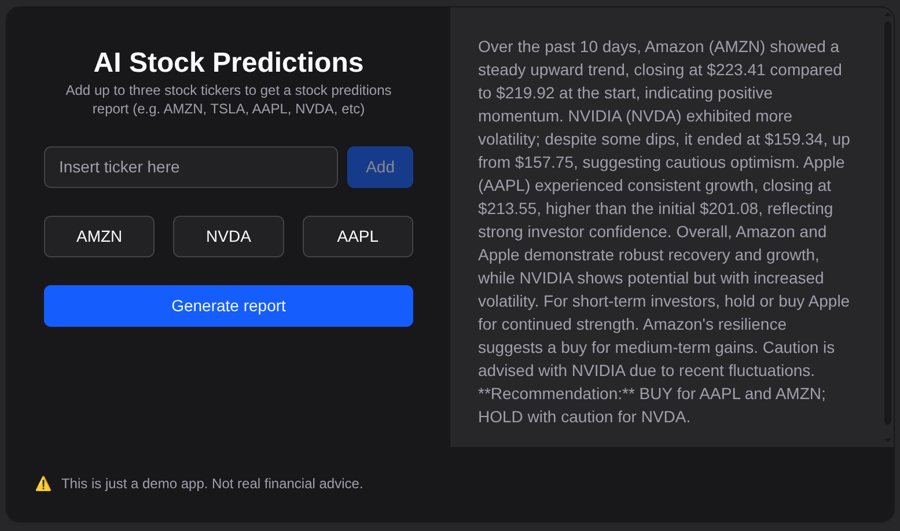

# AI Stock Predictions

A modern web application that uses AI to analyze stock market data and provide investment recommendations. Built with Next.js 15, OpenAI API, and Polygon.io for real-time stock data.



## 🚀 Features

- **Interactive Stock Ticker Input**: Add up to 3 stock tickers (e.g., AMZN, TSLA, AAPL, NVDA)
- **Real-time Stock Data**: Fetches last 10 days of stock price data from Polygon.io
- **AI-Powered Analysis**: Uses OpenAI to generate comprehensive stock analysis reports
- **Real-time Updates**: Instant report generation and display

## 🛠️ Tech Stack

- **Frontend**: Next.js 15, React 19, TypeScript
- **Styling**: Tailwind CSS, Radix UI components
- **APIs**: OpenAI API, Polygon.io API

## 📋 Prerequisites

Before running this application, make sure you have:

- Node.js 18+ installed
- npm, yarn, pnpm, or bun package manager
- OpenAI API account and API key
- Polygon.io API account and API key

## 🔧 Installation

1. **Clone the repository:**

   ```bash
   git clone <repository-url>
   cd ai-stock-predictions
   ```

2. **Install dependencies:**

   ```bash
   npm install
   # or
   yarn install
   # or
   pnpm install
   # or
   bun install
   ```

3. **Set up environment variables:**
   Create a `.env` file in the root directory and add the following:

   ```env
   OPENAI_API_KEY=your_openai_api_key_here
   OPENAI_MODEL=gpt-4o-mini
   POLYGON_API_KEY=your_polygon_api_key_here
   ```

### Where to Get API Keys:

1. **OpenAI API Key**:

   - Go to [OpenAI API Platform](https://platform.openai.com/api-keys)
   - Create an account and generate an API key
   - Add billing information for API usage

2. **Polygon.io API Key**:
   - Go to [Polygon.io](https://polygon.io/)
   - Sign up for a free account
   - Get your API key from the dashboard

## 🚀 Running the Application

1. **Run:**

   ```bash
   npm run dev
   # or
   yarn dev
   # or
   pnpm dev
   # or
   bun dev
   ```

2. **Open your browser:**
   Navigate to [http://localhost:3000](http://localhost:3000)

## 📖 How to Use

1. **Add Stock Tickers**: Enter up to 3 valid stock ticker symbols (e.g., AAPL, GOOGL, MSFT)
2. **Generate Report**: Click "Generate report" to fetch stock data and AI analysis
3. **View Analysis**: The AI will provide a comprehensive analysis with buy/hold/sell recommendations
4. **Manage Tickers**: Click on any ticker to remove it and add new ones

## ⚠️ Important Notes

- **Not Financial Advice**: This is a demo application. Do not use for actual investment decisions.
- **API Costs**: Both OpenAI and Polygon.io APIs have usage-based pricing
- **Rate Limits**: Be aware of API rate limits when testing
